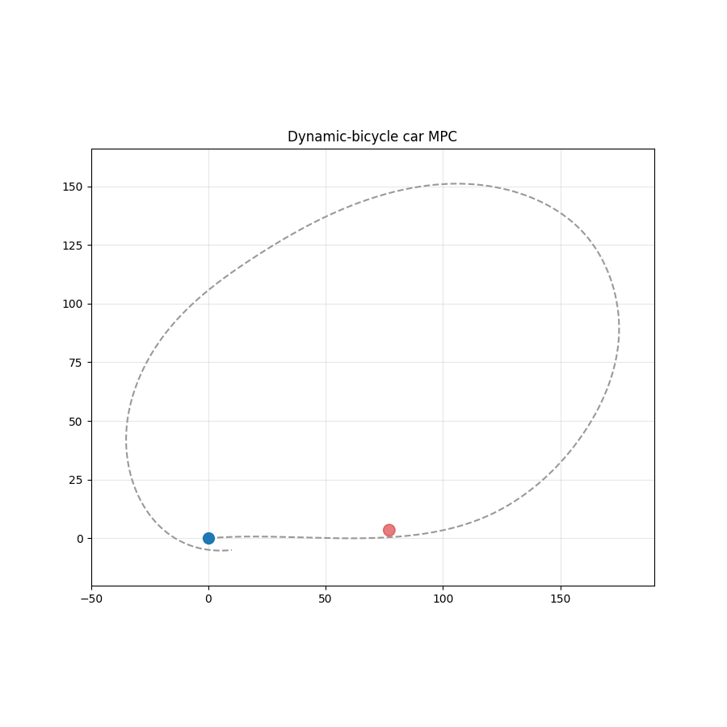

# dcmpc - Dynamic-Bicycle Car MPC

A real-time **iterative Model Predictive Controller (MPC)** for an autonomous
car, built on the **dynamic single-track ("bicycle") model with a linear tire
model** - the same class of model used in professional autonomous-driving and
motorsport stacks. It tracks a reference path, slows for corners and obstacles
the way a human driver does, and runs both in a custom pygame visualizer and on
**CARLA 0.9.15** with a virtual-LiDAR perception front-end.

On CARLA the stack is **decoupled into two layers** (the architecture modern AV
stacks use): a **kinematic planner** (`planner.py`) bends the reference path
around obstacles - always feasible, it's just geometry - and the **dynamic MPC**
then tracks that already-safe path with no obstacle constraint in the QP. The
perception front-end runs the raw LiDAR through a **multi-object Kalman tracker**
(`tracker.py`) for stable identities, smoothed positions and coasting through
dropouts. The bridge runs in CARLA's **synchronous mode** with per-stage timing
and frame-lag instrumentation, so every steering and throttle command is
provably computed from the same simulation frame the LiDAR saw. The original
single-QP soft-half-plane avoidance is still available (`USE_PATH_PLANNER =
False`) and is what the pygame sim uses.



---

## Table of contents

1. [Quick start (step by step)](#quick-start-step-by-step)
2. [What each command does](#what-each-command-does)
3. [Debugging the LiDAR](#debugging-the-lidar)
4. [Package layout](#package-layout)
5. [The maths, and why the car behaves the way it does](#the-maths-and-why-the-car-behaves-the-way-it-does)
6. [Tech stack & concepts (and how they're implemented)](#tech-stack--concepts-and-how-theyre-implemented)
7. [Configuring the scenario](#configuring-the-scenario)
8. [Extensions](#extensions)

---

## Quick start (step by step)

**1. Get the code and a clean Python environment.**

```bash
git clone <your-repo> dcmpc
cd dcmpc
python -m venv .venv
source .venv/bin/activate          # Windows: .venv\Scripts\activate
```

**2. Install the package (editable, so edits take effect immediately).**

```bash
pip install -e ".[viz]"            # core solver + pygame viewers
```

That single command pulls in NumPy, SciPy, CVXPY, OSQP, Matplotlib and pygame,
and registers the `dcmpc-*` commands on your PATH.

**3. Run the headless simulation first - no GPU, no CARLA, ~10 seconds.**

```bash
dcmpc-sim --no-gif
```

You'll get `result.png` (the driven line around the track) and `telemetry.png`
(speed / steering / sideslip / lateral-g). This is the fastest way to confirm
the controller works on your machine.

**4. Watch it drive live.**

```bash
dcmpc-drive
```

Controls: **V** switches view (split / 3D / top-down), **TAB** toggles
AUTO ↔ MANUAL, **+ / −** change the cruise speed, **R** resets, **ESC** quits.
In MANUAL mode you steer with the arrow keys - useful for *feeling* the tire
dynamics (the yaw rate and sideslip lag behind your steering input, exactly as
in a real car).

**5. (Optional) Run on CARLA.**

```bash
# install CARLA's Python API to match your server build
pip install carla==<your CARLA server version>

# start the simulator (separate terminal), wait for the map to load
./CarlaUE4.sh                      # Windows: CarlaUE4.exe

# then, in the venv:
dcmpc-carla --debug
```

If CARLA refuses to connect, it's almost always (a) the server isn't finished
loading, or (b) a port clash on 2000 - see [Debugging the LiDAR](#debugging-the-lidar)
and the troubleshooting note at the end of this section.

**6. Inspect a CARLA run.** Every CARLA session writes `carla_trace_*.csv`:

```bash
dcmpc-plot                         # plots the newest trace
```

> **CARLA connection troubleshooting.** If you see a 10 s timeout: confirm the
> server window is fully loaded; check the port with `netstat -ano | findstr 2000`
> (Windows). If two processes are listening on 2000, kill both and start CARLA
> once. To use a non-default port, launch with `-carla-rpc-port=N` and set
> `CARLA_PORT = N` in `src/dcmpc/carla_bridge.py`.

---

## What each command does

| Command | Description |
|---------|-------------|
| `dcmpc-sim`    | Headless closed-loop sim → `result.png`, `telemetry.png`, `demo.gif` |
| `dcmpc-drive`  | Live pygame viewer: 3D chase + top-down split (recommended) |
| `dcmpc-3d`     | Live 3D chase camera only |
| `dcmpc-top`    | Live top-down only |
| `dcmpc-manual` | Open-loop: drive with your own scripted inputs (feel the dynamics) |
| `dcmpc-carla`  | CARLA bridge with virtual-LiDAR perception |
| `dcmpc-plot`   | Plot a `carla_trace_*.csv` from a CARLA run |

Useful flags: `dcmpc-sim --no-gif` (skip the slow animation), `dcmpc-carla
--debug` (per-tick logging), `dcmpc-carla --no-lidar` (use ground-truth actor
positions instead of LiDAR), `dcmpc-carla --view-lidar` (live 2-D filter-debug
plot), `dcmpc-carla --view-lidar-3d` (live 3-D semantic point cloud).

As a library:

```python
from dcmpc import DynamicBicycleMPC, CarParams, AdaptiveSpeed, get_ref_trajectory
```

### Comparing two runs (A/B)

`src/dcmpc/ab_compare.py` does a head-to-head of two CARLA traces - the workflow
for tuning the return-to-lane behaviour:

```bash
python src/dcmpc/ab_compare.py output/baseline.csv output/treatment.csv
```

It prints worst |cross-track|, peak |heading error|, max |steering|, steering
saturation %, and max speed side by side, then a **per-obstacle-pass** breakdown
(peak cross / heading in a pass + 4 s window) and a one-line verdict. Two things
to read deliberately: (1) max speed should be roughly unchanged - if it isn't,
the two runs differed in more than the one knob you meant to test, so the
comparison isn't clean; (2) a pass-count mismatch between baseline and treatment
means the aggregate "✓ better" lines are comparing different events - align the
passes by route position before trusting them. (This is a standalone script, not
a `dcmpc-*` console entry point.)

---

## Debugging the LiDAR

In CARLA the obstacles fed to the MPC come from a **virtual LiDAR**: the raw
point cloud is filtered (height band, forward field-of-view, range, ego
exclusion), grid-clustered, and each surviving cluster becomes a circular
keep-out. When the car stops with apparent free space, or swerves at nothing,
you need to *see what the perception layer sees*:

```bash
dcmpc-carla --view-lidar
```

A live top-down Matplotlib window opens, colour-coded by filter stage:

| Colour | Meaning |
|--------|---------|
| **Grey** | returns dropped by the height filter (ground, overhead) |
| **Orange** | dropped by FOV / range / ego-exclusion |
| **Green** | survived all filters → handed to clustering |
| **Red circle** | a detected obstacle the MPC actually receives (centre + keep-out radius) |

Reading it: if a wall shows up as a **red circle**, raise `LIDAR_MIN_PTS` or
lower `LIDAR_MAX_RADIUS` in `config.py`. If a real car never turns **green**,
loosen the height band (`LIDAR_Z_MIN`, `LIDAR_Z_MAX`) or widen `LIDAR_FOV_DEG`.
All of these live in the config (see *Configuring* below).

### 3D semantic view (like a real AV stack)

For a richer view - a 3D perspective cloud where **each detected cluster gets
its own colour** (cars, poles, scenery), the ground dimmed, and the ego car at
the origin - use:

```bash
dcmpc-carla --view-lidar-3d
```

This uses **Open3D** if installed (`pip install open3d`, included in the `gui`
extra) for a dense, mouse-orbitable GPU window; if Open3D isn't present it falls
back automatically to a lower-fidelity matplotlib-3D window. The clustering used
for colouring is computed independently for the display and never touches the
controller, so the view can't affect driving. You can run `--view-lidar` (2-D
filter debug) and `--view-lidar-3d` (semantic 3-D) together or separately.

> Both live views redraw every tick and **slow the loop down** - use them for
> debugging, not timed runs.

---

## Package layout

```
src/dcmpc/
├── __init__.py        # public API: DynamicBicycleMPC, AdaptiveSpeed, helpers
├── controller.py      # vehicle model + iMPC + AdaptiveSpeed + path helpers
├── planner.py         # Layer 1: kinematic path planner (bends path round obstacles)
├── tracker.py         # multi-object Kalman tracker for the virtual LiDAR
├── config.py          # EDIT THIS: road, obstacles, speed, car physics, CARLA
├── simulate.py        # headless closed-loop sim
├── manual_drive.py    # open-loop scripted inputs
├── carla_bridge.py    # CARLA bridge + virtual-LiDAR perception + 2-D viewer
├── lidar_view3d.py    # 3-D semantic point-cloud viewer (Open3D / matplotlib)
├── plot_trace.py      # CARLA CSV trace plots
├── ab_compare.py      # A/B comparison of two CARLA traces (standalone script)
└── viz/
    ├── drive.py       # unified split-screen viewer
    ├── top_down.py    # standalone top-down
    └── chase_3d.py    # standalone 3D chase camera
```

Because the install is editable, editing `src/dcmpc/config.py` takes effect
immediately - no reinstall.

---

## The maths, and why the car behaves the way it does

### 1. State and the dynamic bicycle model

The car is modelled as a single track (front and rear axles each collapsed to
one wheel). The state and control are

```
X = [x, y, ψ, vx, vy, r]          u = [a, δ]
```

`x, y` position, `ψ` heading, `vx` longitudinal and `vy` lateral velocity (both
in the car's own frame), `r` yaw rate; `a` longitudinal acceleration, `δ` front
steering angle. The continuous dynamics `Ẋ = f(X, u)` are

```
ẋ   = vx·cos ψ − vy·sin ψ          (body velocity rotated into the world)
ẏ   = vx·sin ψ + vy·cos ψ
ψ̇   = r
v̇x  = a + vy·r
v̇y  = (Fyf + Fyr)/m − vx·r
ṙ   = (lf·Fyf − lr·Fyr)/Iz
```

The two terms that make this a *dynamic* model rather than a *kinematic* one are
the `vy·r` / `vx·r` cross-couplings (centripetal effects) and, crucially, the
tire forces `Fyf`, `Fyr`. A kinematic bicycle assumes the car goes exactly where
the wheels point; this model lets the tires **slip**, which is what actually
happens above walking pace and is the whole point of using it.

### 2. Tire forces and slip angles - the source of the behaviour

Each tire generates lateral force in proportion to its **slip angle** - the
angle between where the tire points and where it's actually travelling:

```
αf = δ − (vy + lf·r)/vx        Fyf = Cf · αf
αr =   − (vy − lr·r)/vx        Fyr = Cr · αr
```

`Cf`, `Cr` are the cornering stiffnesses. This linear law is why **the
front-to-rear stiffness balance sets the handling character**:

- `lf·Cf > lr·Cr`-ish balance → the rear grips relatively harder → mild
  **understeer** (the safe, stable default; the car gently pushes wide and
  self-corrects). This project's default Tesla-like parameters are tuned here.
- Lower `Cr` relative to `Cf` → the rear lets go first → **oversteer** (the tail
  steps out). Try it in `config.py` and watch the sideslip trace grow.

Two guards keep this valid at the limits, and both shape the behaviour you see:

- **`tanh` slip saturation:** `α ← α_max · tanh(α/α_max)`. A real tire has a grip
  ceiling - past a few degrees of slip the force stops climbing. The hard clamp
  we used originally has a *zero* derivative past the limit, which makes the
  linearization (below) singular and the solver stall. `tanh` saturates smoothly,
  so the Jacobian stays well-conditioned. This is why solves are stable even in
  hard avoidance manoeuvres.
- **Low-speed fade:** `fade = min(1, |vx|/v_blend)` multiplies the lateral and
  yaw accelerations. The slip-angle formulas divide by `vx`, which blows up as
  the car approaches a stop. Fading the lateral dynamics to zero below a few m/s
  removes that singularity - the model degrades gracefully to "can't generate
  cornering force at standstill," which is physically correct.

**Why steering feels laggy in MANUAL mode:** a step of `δ` doesn't instantly
become yaw rate. It first creates a front slip angle, which builds `Fyf`, which
produces `ṙ`, which integrates into `r`, which then changes the slip angles
again. That chain of integrations is the real first-order-ish lag you see in the
yaw-rate and sideslip telemetry - the signature of a dynamic model.

### 3. From nonlinear model to a QP: linearize, then discretize exactly

MPC needs a *linear* model at each step. Around the current operating point
`(x̄, ū)` we take a first-order expansion `Ẋ ≈ A·X + B·u + c`, where `A`, `B`
are Jacobians and `c` is the affine residual. We compute `A`, `B` by **finite
differences** (`controller._model_matrices`): it keeps the tire algebra in one
obviously-correct place and is robust to the `tanh` nonlinearity. (Analytic
Jacobians would be a pure speed optimization.)

We then need the **discrete** step `X_{k+1} = A_d·X_k + B_d·u_k + C_d`. Rather
than forward Euler (`A_d ≈ I + A·dt`), which can turn the stiff lateral modes
*unstable* for the step sizes we use, we discretize **exactly** with a single
matrix exponential (zero-order hold). Stacking `A`, `B`, `c` into one augmented
matrix `Φ` and exponentiating gives `A_d`, `B_d`, `C_d` in one shot:

```
        ⎡ A  B  c ⎤
Φ·dt =  ⎢ 0  0  0 ⎥ · dt        exp(Φ·dt) → top block = [A_d  B_d  C_d]
        ⎣ 0  0  0 ⎦
```

This is why the prediction stays stable even though the lateral dynamics are
stiff.

### 4. The optimization (QP)

Over a horizon of `N` steps we solve, each control cycle,

```
min  Σ_k [ ‖X_k − X_ref,k‖²_Q + ‖u_k‖²_R + ‖u_k − u_{k−1}‖²_Rd ]
       + ‖X_N − X_ref,N‖²_Qf  +  ρ·Σ_k Σ_j s_{j,k}

s.t. X_{k+1} = A_d,k X_k + B_d,k u_k + C_d,k      (dynamics)
     X_0 = current state
     control & rate limits
     n_{j,k} · X_{k+1} ≥ b_{j,k} − s_{j,k},  s ≥ 0  (obstacle half-planes)
```

- `Q = diag(5, 150, 8, 40, 6, 2)` - the large weight on `y` (150) is lateral
  tracking; that's what keeps the car pinned to the path. The `vy` weight (6)
  damps the sideslip/yaw transient that drives the post-pass return overshoot.
- `Rd = (1, 250)` heavily penalises **steering-rate** changes - this is what
  stops the violent snap-back during a lane change and gives the smooth re-entry.
- The constraints are **soft**: a slack `s` with a big penalty `ρ = 1e5` lets a
  geometrically impossible request degrade gracefully (squeeze the margin a
  little) instead of returning "infeasible" and triggering an emergency brake.

**The lateral corridor (`CROSS_BAND`).** Pinning hard to the exact centreline
means the controller keeps correcting a small, harmless off-centre error - for
example, the slightly off-centre line it naturally holds just after passing an
obstacle - and those corrections are part of what saturates steering on the
return. `CROSS_BAND` makes a band of ±`b` metres around the centreline
penalty-free, costing only the cross-track error *beyond* it. The trick is to do
this without putting an `abs()` in the objective (which would break convexity and
DPP). We pull the cross weight out of the quadratic `Q` and re-apply it to a
non-negative hinge variable `e_k` constrained by

```
e_k ≥  err_cross,k − b
e_k ≥ −err_cross,k − b           (so e_k ≥ max(0, |err_cross,k| − b))
cost += w_cross · Σ_k e_k²
```

Error inside the band drives `e_k` to 0 and costs nothing; error outside is
penalised exactly as before. Set `CROSS_BAND = 0.0` to recover strict-centreline
tracking. **Caveat worth knowing:** the band buys smoothness partly by tolerating
more cross-track error, so a smoother trace is not automatically a *tighter* one -
keep the band well under `ROAD_HALFWIDTH` minus your obstacle clearance, and
verify changes with `ab_compare.py` (below).

The whole problem is built to be **DPP-compliant** (every parameter enters as
`Parameter @ Variable`), so CVXPY canonicalises the structure once and only
swaps in numbers each cycle. That's what gets solve times to ~60-80 ms at 10 Hz.
The solver is wrapped in an OSQP→CLARABEL→OSQP fallback chain, with an emergency
brake only if all of them fail on the same cycle.

### 5. Obstacle avoidance as half-planes

Each obstacle becomes one or more **half-plane** keep-outs. With the obstacle at
`o`, a keep-out radius `R = r_obs + buffer`, and a chosen normal `n` (pointing
from the obstacle toward the side we pass on), the constraint

```
n · (X_xy − o) ≥ R
```

forbids the car from entering the disc on that side. When the car is still
approaching, `n` points longitudinally (stay behind / slow); as it comes
alongside, `n` rotates lateral (push to the open side) - a smooth bulge around
the obstacle. The MPC carries up to `MAX_OBS` of these simultaneously, so it can
thread between several obstacles at once. Which side it commits to is **locked in
world coordinates** so the choice can't flip frame-to-frame as the car moves
(the cause of the earlier spinning).

If neither side has room (`max(room_left, room_right) < 0`), the decision flips
to **stop**: the position reference is clamped to a stop line behind the obstacle
and the speed reference is zeroed, so the controller brakes to a halt instead of
fighting a forward-pulling reference.

This single-QP mode is what the **pygame** sim uses. CARLA uses the decoupled
planner below instead.

### 5b. Decoupled planning + tracking (the CARLA default)

Folding obstacle keep-out into the *same* QP that handles the stiff lateral
dynamics made the problem ill-conditioned at low speed off-path - the solver
would freeze for seconds and the car would swerve. The fix, used in industry, is
to **split the job into two layers** (toggle with `USE_PATH_PLANNER`, default
`True` on CARLA):

- **Layer 1 - kinematic planner (`planner.py`).** Purely geometric, so always
  feasible. For each obstacle it picks the pass side with more room, computes the
  exact lateral shift `needed = keep_out − obstacle_offset`, and writes a smooth
  **raised-cosine** bend into the path: ramp in, hold for a `PASS_ZONE` past the
  obstacle, ramp out. The pass-side and magnitude are **committed in world
  coordinates** so they can't flip frame-to-frame, and a passed obstacle's bend
  **decays over `PLANNER_DECAY_TICKS`** rather than snapping back to centre. When
  the corridor is clear the original path is returned bit-identical.

- **Layer 2 - dynamic MPC (`controller.py`).** Tracks that already-safe path with
  the full bicycle model and **no obstacle constraint in the QP** - so the QP is
  always well-conditioned and fast. The MPC never has to reason about obstacles;
  by the time the path reaches it, it is already safe.

The win: avoidance (a geometry problem) and tracking (a dynamics problem) are
each solved where they're easy, instead of fighting inside one QP.

### 5c. Perception: virtual LiDAR → Kalman tracker

Raw LiDAR clustering is memoryless: identities swap between ticks, a detection
can blink out for a frame, and there's no velocity estimate. `tracker.py` sits
between clustering and the planner and runs a **constant-velocity Kalman filter**
per obstacle, with **Hungarian assignment** for stable identities even when two
obstacles pass close, a confirmation count to suppress one-frame noise, and brief
**coasting** through dropouts (`CARLA_TRACKER_MAX_MISS` ticks). It outputs the
same `(x, y, r, vx, vy)` tuples the rest of the bridge already consumed, so it's
a drop-in perception layer (toggle with `CARLA_TRACKER_ENABLE`).

### 5d. Synchronous operation & diagnostics

The CARLA bridge runs the server in **synchronous mode**: `world.tick()` blocks
until that frame's sensor callbacks have fired, so the LiDAR cloud the loop reads
is always from the *current* frame. The trace logs prove it - a `frame_lag`
column (`world_frame − lidar_frame`) reads **0** on every tick, and per-stage
timing columns (`tick_ms`, `lidar_ms`, `track_ms`, `plan_ms`, `solve_ms`,
`apply_ms`, `loop_ms`) show the loop is entirely MPC-solve-bound. Set
`CARLA_LOG_TIMING = True` to print this per tick.

If a solve ever fails (returns no trajectory), the bridge **holds the last good
command** for up to `CARLA_SOLVE_HOLD_TICKS` ticks instead of slamming on the
brakes - braking removes the very speed the controller needs to keep steering, so
a hold recovers cleanly where a brake would stall.

### 6. Human-like speed (`AdaptiveSpeed`)

The car does not hold a fixed speed. Three effects shape the speed reference:

- **Corner slowdown.** Looking ahead along the path, we find the tightest
  curvature `κ` and cap speed so lateral acceleration stays within a comfortable
  limit. This is just circular-motion physics, `a_lat = v²·κ`, solved for `v`:

  ```
  v_max = √(a_lat_comfort / κ)
  ```

  Higher `a_lat_comfort` → faster, more aggressive cornering; the pygame default
  is 4.5 m/s², while the CARLA bridge passes a cautious 1.5 m/s² for town driving.

- **Obstacle braking.** Speed is reduced in proportion to proximity, scaling from
  cruise down to a floor as the obstacle nears.

- **Smoothing.** The result is passed through a first-order low-pass (time
  constant τ), so the car eases on and off the throttle rather than stepping -
  the gradual feel a human gives.

The HUD's `ADAPT` row shows which effect is active (green = FREE, amber =
CORNER, red = OBS).

### 7. A dynamically feasible reference

The reference itself respects acceleration limits: instead of placing reference
points at a constant `target_v`, `get_ref_trajectory` integrates a speed profile
that ramps up/down within ±a few m/s², so the MPC is never asked to track a
step it physically can't. A **recovery mode** throttles that reference speed when
the car is pushed far off-line (cross-track > 1.5 m), giving the solver room to
steer gently back instead of diverging.

---

## Tech stack & concepts (and how they're implemented)

This section is a map from each technique the project uses to **where it lives in
the code and how it's wired in**. The deep derivations are in *The maths* above;
this is the index.

### The stack

| Library | Used for | Where |
|---------|----------|-------|
| **Python 3.7+** | the whole project | — |
| **NumPy** | state vectors, dynamics, finite-difference Jacobians | `controller.py` |
| **SciPy** (`linalg.expm`) | exact zero-order-hold discretization | `controller._model_matrices` |
| **CVXPY** | builds the QP as a *parametrized* convex program (DPP) | `controller._build_problem` |
| **OSQP** + **Clarabel** | the actual QP solvers (fallback chain) | `controller.solve` |
| **Matplotlib** | telemetry/trace plots + the 2-D LiDAR filter-debug view | `plot_trace.py`, `carla_bridge.py` |
| **pygame** | the live top-down / 3-D chase viewers | `viz/` |
| **Open3D** (optional) | dense, orbitable 3-D semantic point cloud | `lidar_view3d.py` |
| **CARLA 0.9.15 PythonAPI** | the high-fidelity simulator + ray-cast LiDAR sensor | `carla_bridge.py` |

### Control & optimization

| Concept | How it's implemented here | Where |
|---------|---------------------------|-------|
| **Model Predictive Control** (receding horizon) | each tick, solve a finite-horizon optimal-control problem, apply only the first input, re-solve next tick | `controller.solve` |
| **Iterative / successive-linearization MPC** | relinearize the model about the latest predicted trajectory and re-solve, `MPC_MAX_ITER` times per tick (an SQP-style loop) | `controller.solve` |
| **Numerical Jacobian linearization** | perturb each state/control by `eps` and finite-difference `f(X,u)` to get `A`, `B`, plus an affine residual `c` | `controller._model_matrices` |
| **Exact ZOH discretization** | stack `[A B c]` into one augmented matrix and take a single `expm(Φ·dt)`; avoids the instability forward-Euler causes on the stiff lateral modes | `controller._model_matrices` |
| **Quadratic Program** | convex quadratic cost (tracking + input + input-rate) under linear dynamics/limit constraints | `controller._build_problem` |
| **DPP parametrization** | every per-tick quantity enters as `Parameter @ Variable`, so CVXPY canonicalizes the structure **once** and only swaps numbers each cycle → ~60–80 ms solves | `controller._build_problem` |
| **Warm starting** | seed the solver with the previous solution so each QP starts near its optimum | `controller.solve` |
| **Solver fallback chain** | OSQP → Clarabel → OSQP, with an emergency brake only if all fail on the same cycle | `controller.solve` |
| **Soft constraints (penalised slack)** | obstacle keep-outs and limits use a slack variable with a large penalty `ρ`, so an impossible request degrades gracefully instead of returning "infeasible" | `controller._build_problem` |
| **Lateral corridor (hinge deadband)** | cross weight moved out of the quadratic and re-applied to a non-negative hinge `cross_excess ≥ |err| − band`; convex, DPP-safe (full derivation above) | `controller._build_problem` (`_cross_excess`) |

### Vehicle model

| Concept | How it's implemented here | Where |
|---------|---------------------------|-------|
| **Dynamic single-track (bicycle) model** | carries `vy` and yaw-rate `r` as states; cornering force comes from tire slip, not a "goes where it points" assumption | `vehicle_dynamics` |
| **Linear tire model** | lateral force proportional to slip angle, `Fy = C·α`; the front/rear stiffness balance sets under/oversteer | `vehicle_dynamics` |
| **`tanh` slip saturation** | `α ← α_max·tanh(α/α_max)` gives a smooth grip ceiling with a non-zero derivative, so the linearization never goes singular | `vehicle_dynamics` |
| **Low-speed fade** | a `min(1, |vx|/v_blend)` factor fades the lateral/yaw dynamics to zero near standstill, killing the `1/vx` slip-angle singularity | `vehicle_dynamics` |
| **RK4 integration** | the *true plant* in the headless sim is stepped with 4th-order Runge–Kutta for an accurate ground truth | `rk4_step` |

### Planning — Layer 1 (CARLA default)

| Concept | How it's implemented here | Where |
|---------|---------------------------|-------|
| **Decoupled planning + tracking** | a purely kinematic planner bends the *reference path* around obstacles; the MPC then tracks that already-safe path with **no obstacle constraint in the QP** | `planner.py` + `controller.py` |
| **Raised-cosine lateral bend** | the avoidance shift ramps in, holds for `PASS_ZONE` past the obstacle, then ramps out — `C¹`-smooth so the MPC isn't fed a corner | `planner.py` |
| **World-frame side commitment** | the chosen pass side + shift magnitude are locked in world coordinates and updated in place, so the bend can't wobble frame-to-frame | `planner.py` / `controller` obstacle locks |
| **Post-pass bend decay** | a passed obstacle's bend lingers and decays over `PLANNER_DECAY_TICKS` instead of snapping back to centre (a snap stalled the car) | `planner.py` |
| **Half-plane keep-outs** (single-QP mode) | the pygame path keeps avoidance *inside* the QP: `n·(x−o) ≥ R` per obstacle, normal rotating from longitudinal to lateral as the car comes alongside | `controller.solve` |

### Perception & estimation (CARLA)

| Concept | How it's implemented here | Where |
|---------|---------------------------|-------|
| **Virtual LiDAR** | CARLA's `sensor.lidar.ray_cast` is attached to the ego car; its point cloud is the only obstacle input (unless `--no-lidar`) | `carla_bridge.py` |
| **Filtering pipeline** | returns are culled by sensor-frame height band, forward FOV arc, max range and an ego-exclusion radius before clustering | `carla_bridge.py` |
| **Grid clustering (flood fill)** | survivors are bucketed into grid cells and flood-fill-connected into clusters (no SciPy dependency); each cluster becomes a circular keep-out, oversized ones rejected as walls | `carla_bridge.py` |
| **Constant-velocity Kalman filter** | each obstacle gets a `[x, y, vx, vy]` track with predict/update, giving smoothed position **and** a velocity estimate the raw clustering can't | `tracker.py` |
| **Hungarian assignment + gating** | detections are matched to existing tracks by optimal assignment within a gate radius, so identities stay stable when two obstacles pass close | `tracker.py` |
| **Track lifecycle** | a track must be confirmed over `CARLA_TRACKER_CONFIRM` ticks before output, and **coasts** through up to `CARLA_TRACKER_MAX_MISS` missed detections before being dropped (survives brief occlusion while passing) | `tracker.py` |

### Speed & reference shaping

| Concept | How it's implemented here | Where |
|---------|---------------------------|-------|
| **Curvature-limited speed** | look ahead for the tightest curvature `κ`, cap speed at `v = √(a_lat_comfort/κ)` so lateral-g stays comfortable | `AdaptiveSpeed` (`controller.py`) |
| **Proximity braking** | reference speed scales from cruise down to a floor in proportion to obstacle distance | `AdaptiveSpeed` |
| **First-order low-pass** | the speed reference is smoothed with time constant `τ`, so throttle eases on/off like a human | `AdaptiveSpeed` |
| **Feasible reference profile** | `get_ref_trajectory` integrates an accel/brake-limited speed profile instead of a constant target, so the MPC is never asked to track a physically impossible step | `controller.get_ref_trajectory` |
| **Recovery throttle** | when cross-track exceeds ~1.5 m the reference speed is cut, giving the solver room to steer gently back rather than diverge | `controller.get_ref_trajectory` |

### Infrastructure & tooling

| Concept | How it's implemented here | Where |
|---------|---------------------------|-------|
| **Synchronous CARLA stepping** | `world.tick()` blocks until that frame's sensor callbacks fire, so the LiDAR cloud is always from the current frame | `carla_bridge.py` |
| **Frame-lag instrumentation** | a `frame_lag = world_frame − lidar_frame` column (reads 0) plus per-stage `*_ms` timings prove the loop is synchronous and MPC-solve-bound | `carla_bridge.py` |
| **Hold-last-command recovery** | on a failed solve, reuse the last good command for `CARLA_SOLVE_HOLD_TICKS` ticks instead of braking (braking removes the speed needed to keep steering) | `carla_bridge.py` |
| **CSV trace logging + plotting** | every tick is written to `carla_trace_*.csv`; `plot_trace.py` renders the newest one | `carla_bridge.py`, `plot_trace.py` |
| **A/B trace comparison** | `ab_compare.py` diffs two traces on overshoot metrics with a per-pass breakdown and a next-knob verdict | `ab_compare.py` |
| **Software 3-D renderer** (no OpenGL) | a layered painter (ground→road→props), per-face depth sort, distance fog and a G-force HUD — pure pygame | `viz/chase_3d.py` |
| **Editable install + central config** | one `pip install -e .`, every tunable in `config.py`, console entry points registered in `pyproject.toml` | `pyproject.toml`, `config.py` |

---

**Every tunable in the project lives in one place - `src/dcmpc/config.py`** -
grouped by subsystem, each with a comment explaining what it does and which way
to turn it. Because the install is editable, edits take effect with no reinstall.
The groups:

- **Road** - `TRACK_X` / `TRACK_Y` centreline waypoints (a smooth spline is fit
  through them).
- **Speed** - `TARGET_SPEED`, `START_SPEED`.
- **Obstacles** - the `OBSTACLES` list: place by world coords `{"x","y","radius"}`
  or relative to the road `{"along": 0-1, "offset": ±m, "radius"}`.
- **Car physics** - `CAR = dict(m, Iz, lf, lr, Cf, Cr)`. Lower `Cr` for
  oversteer; raise it for more understeer.
- **Controller limits** - `MAX_SPEED`, `MAX_ACC`, `MAX_D_ACC`, `MAX_STEER`,
  `MAX_D_STEER`: the physical envelope the MPC may command.
- **Cost weights** - `STATE_COST`, `FINAL_STATE_COST`, `INPUT_COST`,
  `INPUT_RATE_COST`: what the MPC optimises. Raise the cross-track term for
  tighter path-following; raise the steering-rate term for smoother steering;
  raise the `vy` term to damp the post-pass sideslip overshoot.
- **Lateral corridor** - `CROSS_BAND`: a penalty-free band (metres) around the
  centreline so the controller stops fighting a small, harmless off-centre line.
  `0.0` = strict centreline. Keep well under `ROAD_HALFWIDTH` minus obstacle
  clearance, and confirm changes with `ab_compare.py` (a wider band trades
  tracking tightness for smoothness).
- **Avoidance** - `OBSTACLE_SAFETY_MARGIN` (clearance, default 0.2 m),
  `ROAD_HALFWIDTH` (overtake-vs-stop), `PASS_ZONE` (keep-out length past the
  obstacle), `SLACK_PENALTY`.
- **Adaptive speed (pygame only)** - `ADAPT_A_LAT_COMFORT` (cornering
  aggressiveness), `ADAPT_LOOKAHEAD`, `ADAPT_OBS_BRAKE_START/END`, `ADAPT_V_MIN`,
  `ADAPT_TAU`. **These drive the pygame sim only** - CARLA has its own
  `CARLA_*` speed group below, so editing `ADAPT_*` will not change a CARLA run.
- **Timing** - `DT`, `HORIZON_TIME` (shared by both).
- **Planner (CARLA, the decoupled Layer 1)** - `USE_PATH_PLANNER` (master
  toggle), `PLANNER_RAMP_GAIN` / `PLANNER_RAMP_MIN` (how gently the bend ramps
  in/out), `PLANNER_DECAY_TICKS` (how long a passed obstacle's bend lingers).
- **CARLA driving** - `CARLA_TARGET_SPEED`, `CARLA_A_LAT_COMFORT`,
  `CARLA_OBS_BRAKE_START/END`, `CARLA_V_MIN`, throttle/brake mapping,
  `CARLA_OBSTACLE_RADIUS`, `CARLA_SOLVE_HOLD_TICKS` (hold-on-failed-solve),
  `CARLA_OUTPUT_DIR`, `CARLA_LOG_TIMING`.
- **Virtual LiDAR** - `LIDAR_Z_MIN/MAX` (height band), `LIDAR_FOV_DEG`,
  `LIDAR_EGO_EXCLUSION`, `LIDAR_MAX_RANGE`, `LIDAR_CLUSTER_CELL`, `LIDAR_MIN_PTS`,
  `LIDAR_MAX_RADIUS` (wall rejection). These decide what the perception layer
  treats as an obstacle versus ground/wall/scenery.
- **Kalman tracker (CARLA)** - `CARLA_TRACKER_ENABLE`, `CARLA_TRACKER_GATE`,
  `CARLA_TRACKER_Q_ACCEL`, `CARLA_TRACKER_MEAS_VAR`, `CARLA_TRACKER_CONFIRM`,
  `CARLA_TRACKER_MAX_MISS` (how long a track coasts through dropouts).

Quick tuning cheatsheet (also at the top of the file):

| Symptom | Knob |
|---------|------|
| Passes obstacles too close | raise `OBSTACLE_SAFETY_MARGIN` |
| Swerves too wide | lower `OBSTACLE_SAFETY_MARGIN` |
| Too timid in corners | raise `ADAPT_A_LAT_COMFORT` |
| Cuts back in too early after a pass | raise `PASS_ZONE` |
| Drifts off the path | raise `STATE_COST` cross-track term (index 1) |
| Steering oscillates / snaps | raise `INPUT_RATE_COST` steering term (index 1) |
| Fights a harmless off-centre line after a pass | raise `CROSS_BAND` |
| Overshoots heading on the return to lane | raise `STATE_COST` `vy` term (index 4) |
| Walls detected as obstacles (CARLA) | raise `LIDAR_MIN_PTS` or lower `LIDAR_MAX_RADIUS` |

---

## Performance note (CARLA frame rate)

CARLA renders on the GPU; the MPC solves on the CPU. The QP solve is the
per-tick bottleneck, so on a slower machine the control loop runs slower than
CARLA's render rate. This is expected - it's a CPU optimisation problem, not a
graphics one, and a GPU would not help a QP this small (the host↔device transfer
overhead exceeds the solve). If you need more headroom, the CPU levers are:
shorten `HORIZON_TIME` (solve time scales with horizon length) and keep the
scene's obstacle count modest. These trade foresight for speed, so change them
deliberately and re-test.

---

## Extensions

Pacejka nonlinear tire model (a real friction ceiling instead of the linear-plus-
`tanh` approximation), analytic Jacobians (faster solves), a ROS 2 bridge, and a
learned-dynamics variant with conformal-prediction safety tubes for
out-of-distribution robustness.

See `CHANGELOG.md` for the full development history.